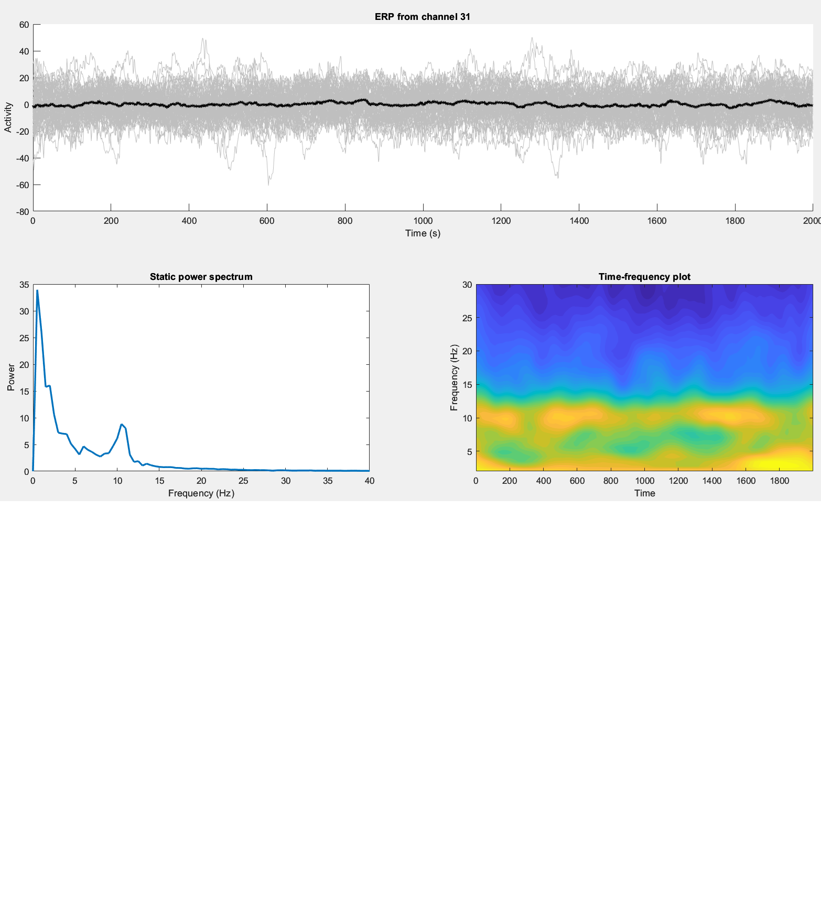
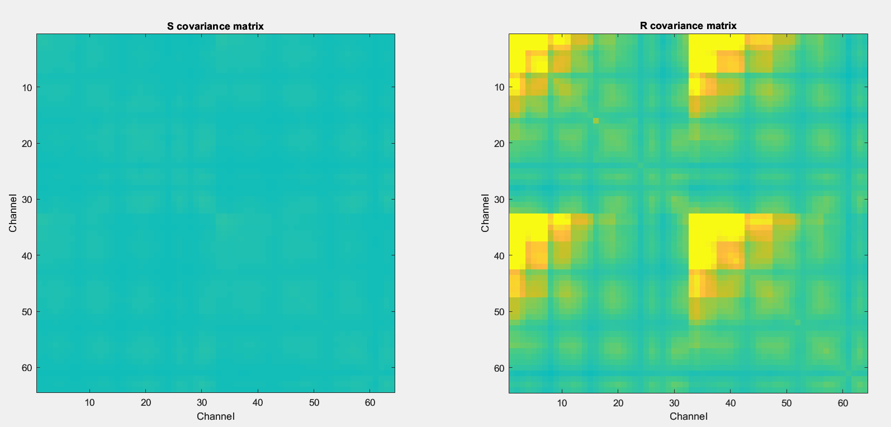
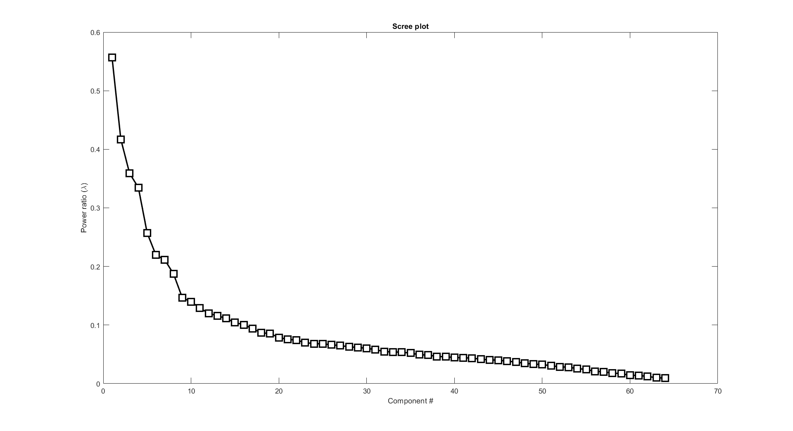
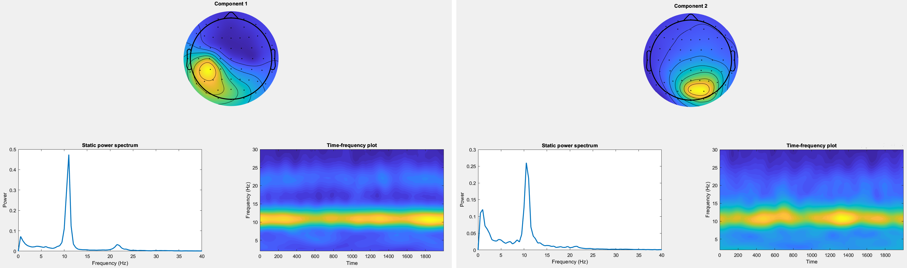
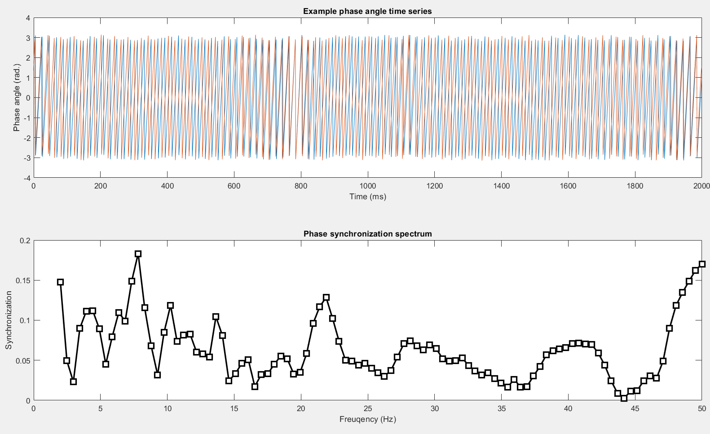
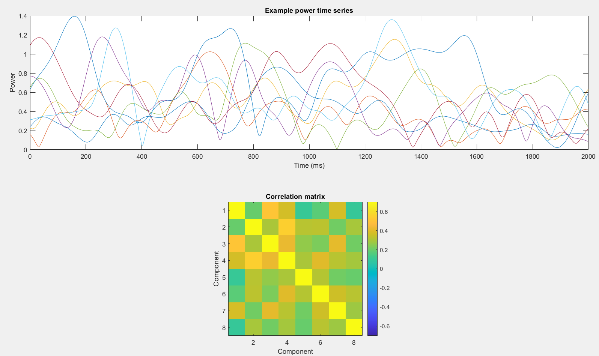
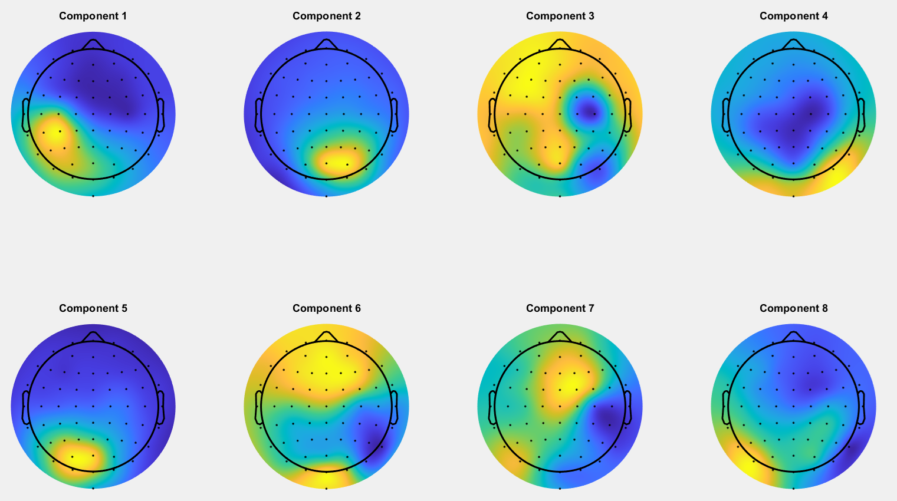

# EEG Signal Processing with MATLAB: Alpha Source Separation and GED

This project uses MATLAB to process resting-state EEG signals, focusing on alpha source separation and Generalized Eigenvalue Decomposition (GED). The goal is to isolate and analyze brain activity patterns in the alpha band using GED to reveal spatial components, compute synchronization, and generate topographic maps.

---

## Project Overview

We apply GED to identify sources in alpha-band EEG data, using key components derived from GED for phase synchronization, power spectrum analysis, and amplitude correlations.

---

## Step-by-Step Process

### 1. Load and Inspect Data

First, load the EEG dataset and inspect its structure. 

```matlab
load('restingstate.mat')

% Inspect the EEG data structure
EEG

% Plot a sample EEG signal
plot_simEEG(EEG,31,10)
```



### 2. Alpha Band Source Separation

To focus on the alpha frequency band, filter the EEG data and calculate covariance matrices for each trial to prepare for GED.

### 3. Visualize Covariance Matrices

Display the S and R covariance matrices for comparison.



### 4. Perform GED and Sort Components

Apply GED to compute eigenvalues and eigenvectors, sorting them by power ratio.




### 5. Extract and Plot Component Time Series

Extract the top components and add them as new EEG channels.



### 6. Phase Synchronization Analysis

Analyze phase synchronization between the top two components across frequencies and the phase angles and power spectra for the selected components.



### 7. Amplitude Correlations Across Top Components

Compute and plot amplitude time series correlations across the top 8 components.



### 8. Topographic Visualization of Top Components

Visualize the spatial topographies of the top 8 GED components.



## Conclusion
This project demonstrates the use of MATLAB for advanced EEG signal processing, emphasizing source separation through GED, synchronization analysis, and topographic mapping. The extracted components reveal insights into brain connectivity, power distribution, and frequency-specific synchronization in the alpha band.


